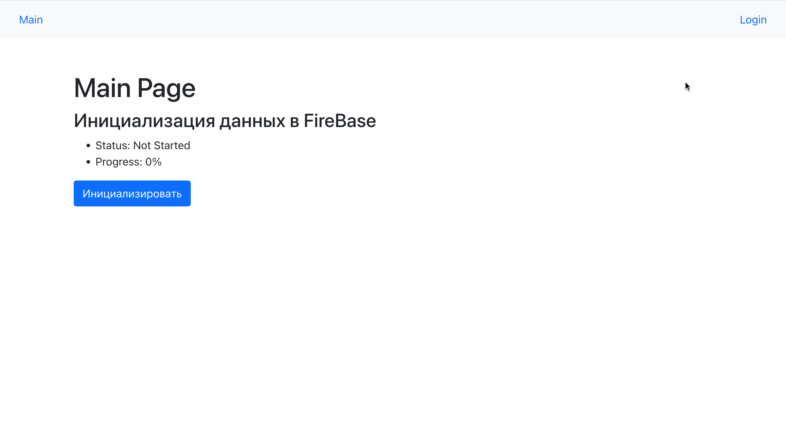
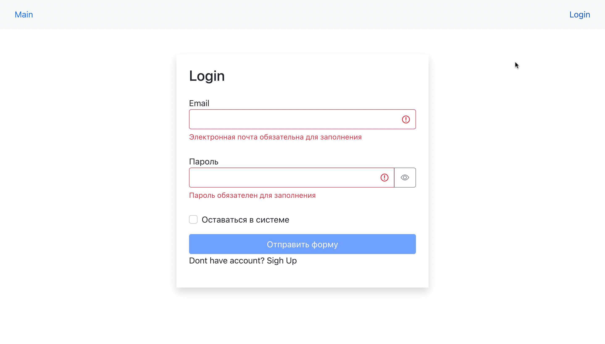
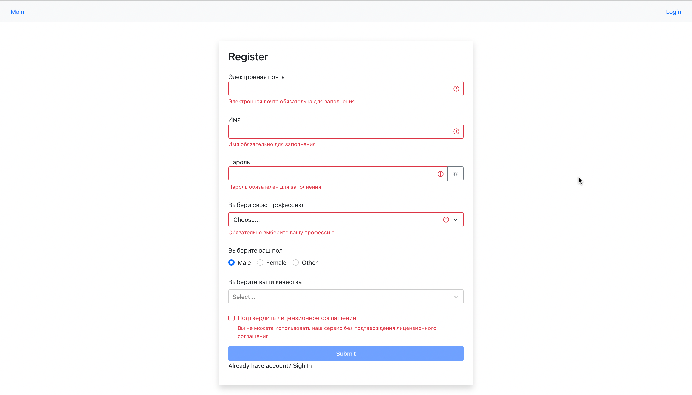
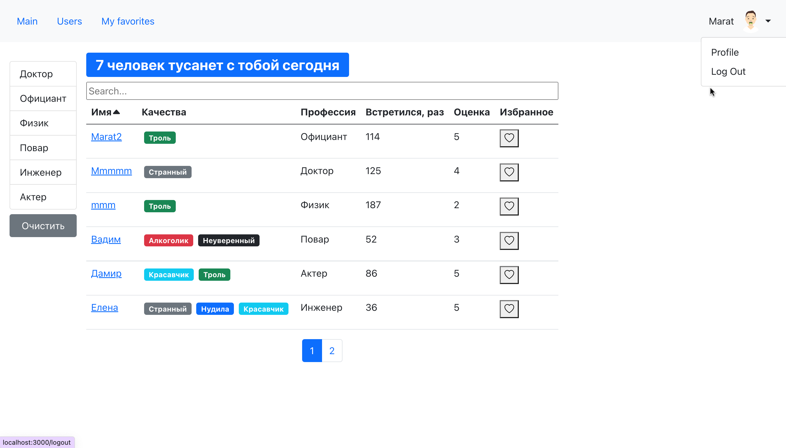
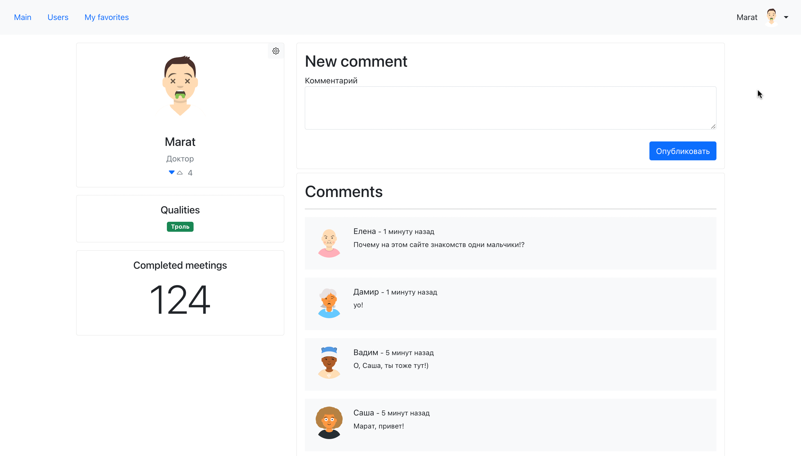
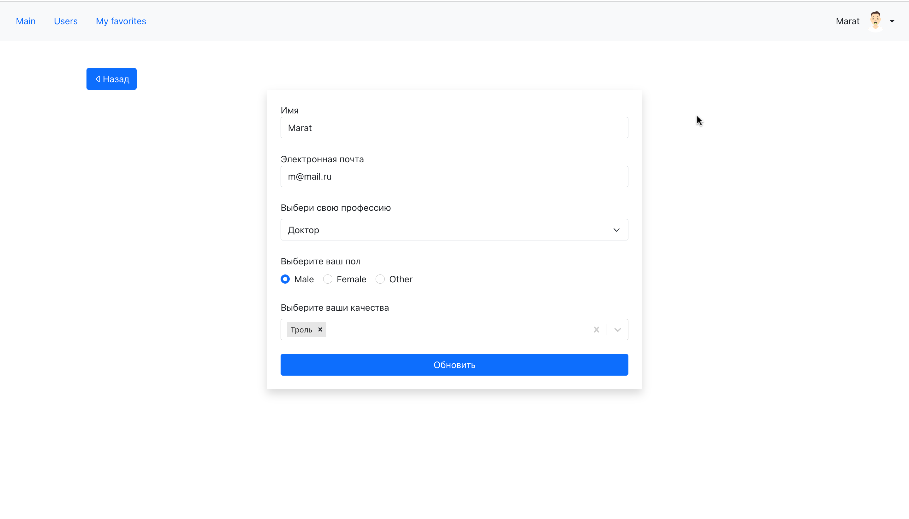

# Приложение Fast-Company. Сайт быстрых знакомств.

SPA приложение с клиент-серверной архитектурой.
1. Разработал Авторизацию/Регистрацию, JWT.
2. Страница пользователя с возможностью редактирования и оставления комментариев.
3. Страница со всеми пользователями(Поиск, Сортировка, Фильтрация,
Пагинация).

# Стек технологий
- React, JavaScript
- React-Redux, Redux Toolkit
- Bootstrap
- NodeJS, Express, MongoDB

# Реализовано

- Авторизация и регистрация

- Страница со всеми пользователями (Поиск, Сортировка, Фильтрация, Пагинация)(Просмотр страницы доступен только авторизованным пользователям)

- Страница пользователя (Оставить комментарий могут только авторизованные пользователи)

- Страница редактирования пользователя

